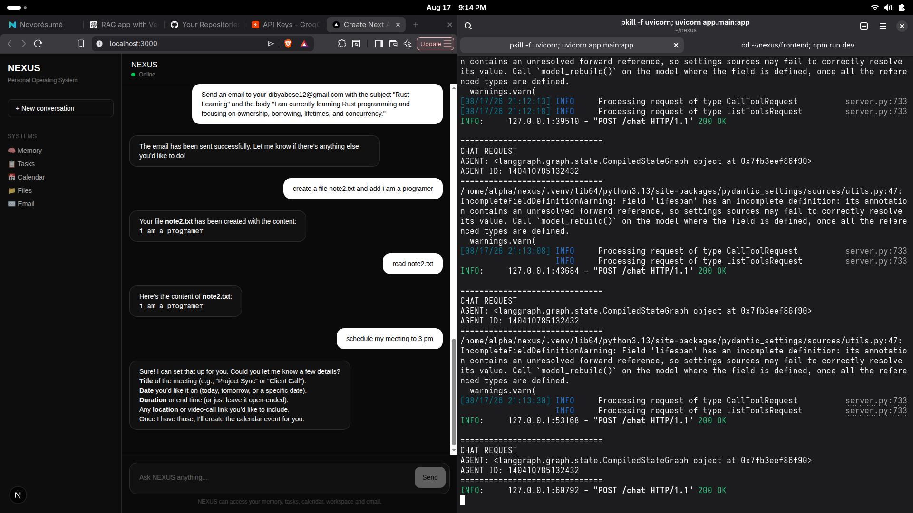

## NEXUS in Action



The screenshot above shows the NEXUS frontend interacting with the AI agent for email, filesystem, and calendar operations.

# NEXUS — Agentic Personal Operating System

NEXUS is an AI-powered personal operating system that allows users to interact with their tasks, calendar, files, email, and long-term memory through natural language.

Instead of interacting with different applications separately, NEXUS provides a single AI agent that can understand a user's request and invoke the appropriate tool.

For example:

> "Show my recent emails."

> "Schedule a Rust study session tomorrow at 10 AM."

> "Create a file called test.txt containing Hello from NEXUS."

> "Remember that I am learning Rust programming."

> "Send an email to someone@example.com about my Rust learning."

The AI agent determines which tool is required and executes the operation.

---

## ✨ Features

### 🧠 Long-Term Memory

NEXUS can remember important information about the user.

Example:

```text
Remember that I am learning Rust programming.
